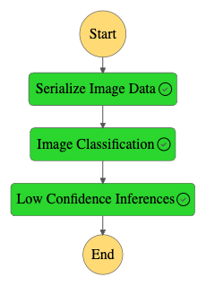

# Machine Learning Workflow for Scones Unlimited on AWS

## Project Overview

This project demonstrates a comprehensive machine learning workflow using AWS services, focused on the CIFAR-100 dataset. The workflow includes data staging, model training, deployment, and orchestration using AWS Lambda and Step Functions. Below is a detailed description of each step undertaken in this project.

## Steps Completed

### 1. Dataset: CIFAR-100

The project utilizes the CIFAR-100 dataset, a popular benchmark in image classification tasks. This dataset contains 60,000 32x32 color images in 100 classes, with 600 images per class. The dataset was selected for its diverse range of classes and its suitability for testing image classification models.

### 2. Data Staging and Preparation

**Extract, Transform, Load (ETL)**

- **Data Extraction**: The CIFAR-100 dataset was extracted from its source and uploaded to an Amazon S3 bucket.
- **Data Transformation**: Images were preprocessed to ensure consistency and quality for model training. This included resizing and normalization.
- **Data Loading**: The transformed data was loaded into Amazon SageMaker for model training.

### 3. Model Training

- **Model Selection**: A convolutional neural network (CNN) model was chosen for its effectiveness in image classification tasks.
- **Training**: Using Amazon SageMaker, the model was trained on the CIFAR-100 dataset. The training process involved setting up the SageMaker environment, configuring hyperparameters, and monitoring training progress.
- **Validation**: The model's performance was evaluated using validation metrics to ensure it met the required accuracy standards.

### 4. Model Deployment

- **Endpoint Creation**: After successful training, the model was deployed as a real-time endpoint on SageMaker. This endpoint allows for predictions on new, unseen images.

### 5. Lambda Functions

Three AWS Lambda functions were created to handle different aspects of the workflow:

1. **Image Data Serialization**:
   - **Purpose**: Extracts an image from S3, base64 encodes it, and returns it as `image_data` in the event.
   - **Functionality**: Downloads the image from S3, encodes it, and prepares the data for further processing.

2. **Image Classification**:
   - **Purpose**: Decodes the image data, performs classification using the SageMaker model endpoint, and returns the inferences.
   - **Functionality**: Interacts with the SageMaker model endpoint to get predictions and processes the results.

3. **Inference Filtering**:
   - **Purpose**: Filters out inferences with low confidence levels based on a defined threshold.
   - **Functionality**: Checks if the model's confidence exceeds a specified threshold and decides whether to pass or fail the inference.

### 6. Step Functions Workflow

  

- **Workflow Construction**: Using AWS Step Functions, a workflow was created to orchestrate the Lambda functions. The workflow is designed to chain the functions together, starting with data serialization, followed by image classification, and ending with inference filtering.
- **Visual Editor**: The Step Functions visual editor was used to design and configure the workflow, including input and output filtering and error handling settings.
- **Export and Documentation**: The final workflow was exported as a JSON file and a screenshot of the working Step Function was captured for documentation purposes.

### 7. Testing and Evaluation

- **Test Cases**: Various test cases were generated to validate the workflow. The generated test cases were used to execute the Step Function and verify its functionality.
- **Monitoring**: Captured data from SageMaker Model Monitor was analyzed to ensure the model's performance and to visualize the results.
- **Visualization**: Custom visualizations were created to monitor the model's predictions and confidence levels over time.

## License

This project is licensed under the MIT License - see the LICENSE file for details.

## Acknowledgments

This project was completed as part of the advanced Machine Learning Nanodegree Program by Udacity and AWS.

